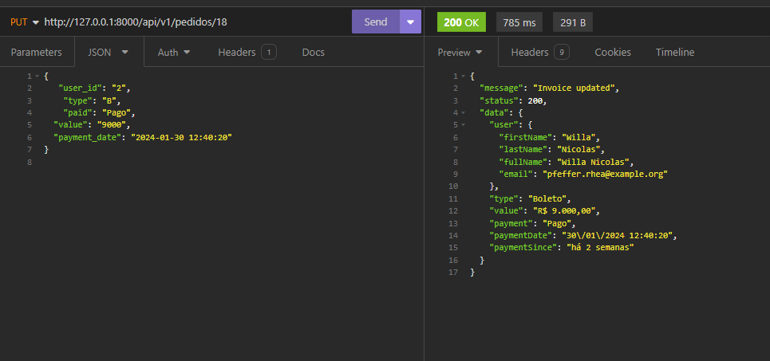

# Teste php -1


## 💻 Pré-requisitos

-Laravel
-php 8
-docker
-insomnia

## 🚀 Instalando <Teste php 1>

Para instalar o <Teste php 1>, siga estas etapas:

primeiro edite o arquivo .env

DB_DATABASE=testephp
DB_USERNAME=root
DB_PASSWORD=root

Docker:Criando o banco de dados
```
docker composer -up
```

Agora execute as migrations e os seeders
```
php artisan migrate:fresh --seed
```

Temos dois diretorios
Alphacode é onde esta a API.
 inicie o servidor:
```
php artisan serve
```

Alphacode-front onde esta a aplicação.
 inicie:
```
php artisan serve --port=8001
```
## ☕ Usando <Teste php 1>

Para usar <Teste php 1>, siga estas etapas:

End points:Todas as rotas retornan Json 
Login:
Todos os logins cadastrados possuem a mesma senha: password
```
http://127.0.0.1:8000/api/v1/login
```
passe o json abaixo:
Precisa efetuar o login por conta da autenticação.
```
{
        "email":"exemplo@example.org",
		"password":"password"
}
```
Rota de Pedidos
```
http://127.0.0.1:8000/api/v1/pedidos/3
```
```
{
   "user_id": "3",
    "type": "B",
    "paid": "Pago",
	"value": "1000",
	"payment_date": "2024-01-30 12:40:20"
}

```
Esse end point retorna o pedido do cliente como pago , em aberto ou cancelado ,possui tipo de pagamento , Boleto Pix ou Cartão


Segue arquivo com todas as rotas(insomnia)
[Rotas](images/Insomnia_2024-02-21.json)


